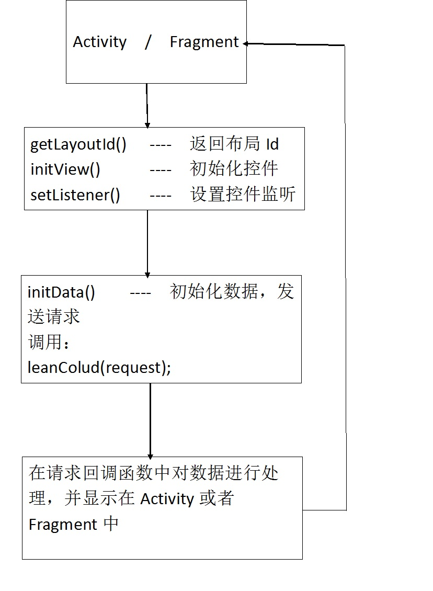

## 开始使用leancloud-android-framework

  - [Activity 和 Fragment](#activity-和-fragment)
  - [请求](#请求)
    - [增加请求]()
    - [删除请求]()
    - [更新请求]()
    - [查找请求]()
    - [文件请求]()
    - [登录请求]()
    - [注册请求]()
  - [请求回调](#请求回调)
  - [流程图](#流程图)

## Activity 和 Fragment

1. 所有Activity都继承BaseActivity,所有Fragment都继承BaseFragment

2. 完成BaseActivity和BaseFragment的抽象方法
  
  * getLayoutId()  ---- 返回布局Id

  * initView()  ----  初始化控件

  	* 获取控件请使用obtainView(int id)

  	  * **参数说明:**

  	    * id : 控件的id

  * setListener()  ----  设置控件监听

  * initData()  ----  发送请求，一遍初始化数据

## 请求

**注:**  建议开发者在项目中新建一个包(request)来管理所有请求

1. 所有请求都继承Irequest

2. 完成以下3个构造方法
  
  * 构造方法，构造方法参数根据实际需求决定

  * getClassName()  ----  返回LeanCloud要进行操作的表明(类名)

  * getWay()  ----  返回请求的方法

    * INSERT  ----  增加

    * DELETE  ----  删除

    * UPDATE  ----  修改(更新)

    * QUERY  ----  查找

    * FILE  ----  上传文件

    * LOGIN  ----  登录

    * SIGNIN  ----  注册

3. 请求分类
 
  * 增加请求
    * 构造方法  :  XXXRequest(Context context, ArrayList  &lt;AVObject&gt; objects)<br>
    **调用**

      > mObjectListParams = objects;
      * **参数说明:**
        * context  :  上下文
        * objects  :  AVObject集合
          * 统一批量增加，所以使用集合形式
          * 每个对象中已经包含要上传的信息
          * 声明AVObject时，请使用带参数的构造方法
    * getClassName()  :  返回null
    * getWay()  :  返回INSERT

  * 删除请求
    * 构造方法  :  XXXRequest(Context context, ArrayList&lt;AVObject&gt; objects)<br>
    **调用**

      > mObjectListParams = objects;
      * **参数说明:**
        * context  :  上下文
        * objects  :  AVObject集合
          * 统一批量增加，所以使用集合形式
          * 每个对象中不为null
          * 每个对象已经表明该对象的表明
    * getClassName()  :  返回null
    * getWay()  :  返回DELETE

  * 更新请求
    * 构造方法  :  XXXRequest(Context context, AVObject object)<br>
    **调用**

      > mObjectParams = object;
      * **参数说明:**
        * context  :  上下文
        * object  :  AVObject对象
          * 对象中已经包含要更新的信息
          * 对象已经表明该对象的表明
    * getClassName()  :  返回null
    * getWay()  :  返回UPDATE

  * 查找请求
    * 构造方法  :  XXXRequest(Context context, ...)<br>
    **调用**

      > mSimpleParams.put(key,value);<br>
      > **key  ----  value**<br>
      > "list"  ----  List&lt;AVObject&gt;  ----  AVObject集合，用于刷新和加载获取临界值<br>
      > "refresh"  ----  boolean  ----  是否刷新<br>
      > "ascend"  ----  String[]  ----  按那些键值升序排序<br>
      > "descend"  ----  String[]  ----  按那些键值降序排序<br>
      > "limit"  ----  int  ----  限制返回数据个数<br>
      > "great"  ----  Map<String,Object>  ----  按那些键值大于所给的值查找<br>
      > "less"  ----  Map<String,Object>  ----  按那些键值小于所给的值查找<br>
      > "equal"  ----  Map<String,Object>  ----  按那些键值等于所给的值查找<br>
      > "contains"  ----  Map<String,String>  ----  按那些键值里的值与所给的值匹配<br>
      * **参数说明:**
        * context  :  上下文
        * lists  :  AVObject集合
          * 一般为listView中的集合
    * getClassName()  :  返回 [ 具体表明 ]
    * getWay()  :  返回QUERY

  * 文件请求
    * 构造方法  :  XXXRequest(Context context, List&lt;AVFile&gt; files)<br>
    **调用**  

      > mSimpleParams.put("file",files);
      * **参数说明:**
        * context  :  上下文
        * files  :  AVFile集合
    * getClassName()  :  返回null
    * getWay()  :  返回FILE

  * 登录请求
    * 构造方法  :  XXXRequest(Context context, String userName,String password)<br>
    **调用**

      > mSimpleParams.put("userName",userName);<br>
      > mSimpleParams.put("password",password);

      * **参数说明:**
        * userName  :  用户名
        * password  :  密码
    * getClassName()  :  返回null
    * getWay()  :  返回UPDATE

  * 注册请求
    * 构造方法  :  XXXRequest(Context context, String userName,String password)<br>
    **调用**

      > mSimpleParams.put("userName",userName);<br>
      > mSimpleParams.put("password",password);

      * **参数说明:**
        * userName  :  用户名
        * password  :  密码
    * getClassName()  :  返回null
    * getWay()  :  返回SIGNIN

4. 发送请求

```java
leanColud(request);
```
* **参数说明:**
  request  :  各种请求
  

## 请求回调

1. 如果要获取数据(无图片)，请重写一下3个方法

  * onStart(int requestId)  ----  请求开始
    * **参数说明:**
      * requestId : 请求Id

  * onSuccess(int requestId, List&lt;AVObject&gt; list)  ---- 请求成功
    * **参数说明:**
      * requestId : 请求Id
      * list : 请求结果集合

  * onFailure(int requestId, AVException e)  ---- 请求失败
      * **参数说明:**
        * requestId : 请求Id
        * e : 异常

2. 如果要获取数据(有图片)

  **注:**  除了重写3当中的3的方法外，还需在重写3个方法


  * onFileProgress(int requestId, Integer integer, int position)  ----  上传图片进度
    * **参数说明:**
      * requestId : 请求Id
      * integer : 进度
      * position : 图片位置，当同时上传多张图片时，可根据position判断是哪张图片

  * onFileSuccess(int requestId, int position)  ---- 请求成功
    * **参数说明:**
      * requestId : 请求Id
      * position : 图片位置，当同时上传多张图片时，可根据position判断是哪张图片

  * onFileFailure(int requestId, AVException e, int position)  ---- 请求失败
      * **参数说明:**
        * requestId : 请求Id
        * e : 异常
        * position : 图片位置，当同时上传多张图片时，可根据position判断是哪张图片

## 流程图

